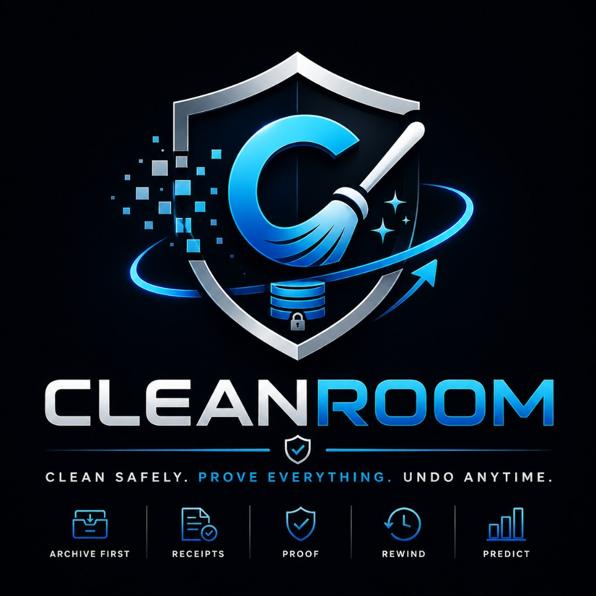

# Cleanroom

<p align="center">
  
</p>

**Cleanroom is a local-only Windows cleanup utility that archives first, proves every action, and lets you restore before anything is permanently pruned.**

It is not a fake "1,247 issues fixed" optimizer. Every cleanup, uninstall leftover, registry export, and prune is logged, receipted, and reversible from the Restore tab or Cleanroom Rewind.

> **Cleanroom is the anti-CCleaner: archive-first cleanup with receipts, custody checks, and rollback — no cloud, no account, no telemetry.**

**Clean safely. Prove everything. Undo anytime.**

Repository: [`cleanroom-windows`](https://github.com/Z3r0DayZion-install/cleanroom-windows)

**Latest release:** [Cleanroom v1.0.3](https://github.com/Z3r0DayZion-install/cleanroom-windows/releases/tag/v1.0.3) — `Cleanroom-Setup-1.0.3.exe` + `SHA256SUMS.txt` (CI-built, attestable)


---

## What's new in v1.0.3

| Area | What you get |
|------|----------------|
| **In-app receipts** | View, copy, and open cleanup/prune receipts without leaving the app |
| **Archive Browser** | Browse archived artifacts in the Activity tab with custody status |
| **Archive-only prune** | Tiered prune recommendations with prune receipts — custody proof, not silent delete |
| **Proof Pack honesty** | Trust score never shows `100/100` when any archived artifact is missing |
| **Program guidance** | Local-only uninstall advice — no cloud lookup |
| **Safer Force Remove** | Preview targets, confirmation required, registry export before delete, install folders archived before removal |

Full release notes: [`docs/RELEASE-v1.0.3.md`](docs/RELEASE-v1.0.3.md)

---

## Why Cleanroom exists

| Typical optimizers | Cleanroom |
|--------------------|-----------|
| "Fixed 1,247 registry errors!" | Shows exact paths and registry keys |
| Deletes permanently | **Archives** to Cleanroom Archive |
| No undo | **Cleanroom Rewind** — roll back a whole day |
| Fake "space freed" totals | **OS-measured** free-space before/after |
| Scare tactics | **Custody Trust Score** — verify artifacts on disk |
| Closed source, bundled junk | Open source, **160+ tests**, local-only |

---

## Product line

| Feature | What it does |
|---------|----------------|
| **Cleanroom** | Main app — review, cleaner, uninstaller, startup, registry snapshot |
| **Cleanroom Receipt** | Itemized proof after every cleanup or prune |
| **Archive Browser** | In-app view of archived files and registry exports |
| **Cleanroom Archive** | Where moved files and `.reg` exports live |
| **Cleanroom Rewind** | Undo an entire day of actions |
| **Custody Trust Score** | 0–100 — % of archived artifacts verified on disk |
| **Proof Pack (HTML)** | Shareable audit report for your full history |
| **Program guidance** | Local-only advice before uninstall or Force Remove |

For README and launch screenshots, open the bundled demo Proof Pack (100% custody verified — not a gaps-detected example):

[`docs/demo/cleanroom-proof-pack-demo.html`](docs/demo/cleanroom-proof-pack-demo.html)

Launch screenshots live in [`assets/screenshots/`](assets/screenshots/).

---

## Quick start

```powershell
python -m pip install -r requirements.txt
python startup_manager_gui.py
```

Or install the latest release: [v1.0.3](https://github.com/Z3r0DayZion-install/cleanroom-windows/releases/tag/v1.0.3).

### Tests

```powershell
python -m pytest -p no:xonsh tests/
```

### Build

```powershell
powershell -ExecutionPolicy Bypass -File build_exe.ps1
powershell -ExecutionPolicy Bypass -File build_installer.ps1
# -> dist\Cleanroom\Cleanroom.exe
# -> dist\Cleanroom-Setup-1.0.3.exe
```

### Verify provenance

Release artifacts are built by GitHub Actions and include artifact attestations. After downloading `Cleanroom-Setup-1.0.3.exe` from [Releases](https://github.com/Z3r0DayZion-install/cleanroom-windows/releases):

```powershell
gh attestation verify .\Cleanroom-Setup-1.0.3.exe --repo Z3r0DayZion-install/cleanroom-windows
```

Compare the SHA256 hash against `SHA256SUMS.txt` attached to the same release.

### Headless (scheduled)

```powershell
Cleanroom.exe --headless-clean
```

---

## Data locations

All local under `%LOCALAPPDATA%\Cleanroom\`. Nothing leaves your PC.

Upgrading from Smart Clean? On first launch, Cleanroom copies `%LOCALAPPDATA%\SmartClean\` → `Cleanroom\`, leaves SmartClean as backup, and writes a **Cleanroom Migration Receipt** (`migration_receipt.txt`).

| Path | Purpose |
|------|---------|
| `cleanup_log.json` | Master action log |
| `receipts/` | Cleanroom Receipts (cleanup + prune) |
| `audits/` | Proof Pack HTML exports |
| `disk_history.json` | Disk Foresight snapshots |
| `ui_prefs.json` | Theme + power-user prefs |

---

## Architecture

```
brand.py                 # Product identity + data paths
startup_manager_gui.py   # Tkinter GUI
proof.py                 # OS measurement + custody checks
ledger.py                # Activity feed + trust score
audit.py                 # Proof Pack HTML export
receipts.py              # Cleanroom Receipts
archive_custody.py       # Archive browser + custody-only prune
program_advice.py        # Local-only uninstall guidance
foresight.py             # Disk-full prediction
timeline.py              # Cleanroom Rewind day buckets
uninstaller.py           # Programs list, leftovers, force remove
registry_health.py       # Evidence-based registry repair
```

---

## License

MIT — see [LICENSE](LICENSE).
